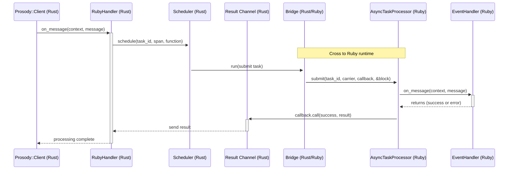

# Prosody Architecture Overview

This document outlines the architecture of the Prosody system, which bridges Rust and Ruby to provide a high-performance Kafka client with an idiomatic Ruby interface.

## Sequence Diagram

Below is the sequence diagram illustrating the flow of processing a Kafka message in Prosody:



## Components

### 1. **Configuration System**

The configuration system bridges Ruby settings to native Rust structures:

- `Prosody::Configuration` provides a Ruby DSL for declaring typed, validated parameters
- Ruby configuration values are serialized to a Rust `NativeConfiguration`
- Configuration is converted to specific Rust builder types (Consumer, Producer, Retry, etc.)
- Handles multiple parameter types: strings, arrays, durations, integers, enums
- Manages environment variable fallbacks for configuration settings

### 2. **Prosody::Client (Rust)**

The main entry point for interacting with Prosody:

- Provides the core interface for sending and receiving Kafka messages
- Manages three operation modes: pipeline, low_latency, and best_effort
- Tracks consumer state, partition assignments, and stall detection
- Provides health checks for liveness and readiness probes

### 3. **RubyHandler (Rust)**

Bridges Kafka consumer messages to Ruby handler implementations:

- Converts Kafka messages into Ruby-compatible objects
- Schedules the execution of Ruby handlers using the Scheduler
- Handles task cancellation during shutdown
- Implements error classification for proper retry behavior

### 4. **Scheduler (Rust)**

Manages task execution in the Ruby runtime:

- Schedules functions to run in Ruby with proper context propagation
- Creates span context carriers for distributed tracing
- Provides task handles for cancellation and result monitoring
- Ensures graceful shutdown with proper resource cleanup

### 5. **Result Channel (Rust)**

One-shot communication channel for task results:

- Enables async waiting for Ruby task completion
- Converts Ruby errors to Rust-compatible error types
- Categorizes errors as permanent or transient for retry decisions
- Ensures results are only delivered once

### 6. **Bridge (Rust/Ruby)**

Enables safe communication between Rust and Ruby:

- Maintains a dedicated Ruby thread for processing Rust-initiated calls
- Handles GVL (Global VM Lock) management to prevent thread blocking
- Uses oneshot channels for synchronization and result passing
- Batches operations to reduce GVL acquisition overhead

### 7. **AsyncTaskProcessor (Ruby)**

Executes tasks asynchronously using the Ruby `async` gem:

- Processes tasks in Fibers for cooperative concurrency
- Propagates OpenTelemetry context bidirectionally
- Provides cancellation tokens to abort in-flight operations
- Tracks active tasks for graceful shutdown

### 8. **EventHandler (Ruby)**

User-defined Ruby class that processes messages:

- Implements `on_message(context, message)` with custom processing logic
- Can categorize exceptions as permanent or transient using decorators
- Receives messages with deserialized JSON payloads
- Operates within the OpenTelemetry context of the message

### 9. **Health Probe Server**

Provides HTTP endpoints for monitoring consumer health:

- `/readyz`: Readiness probe checking partition assignment status
- `/livez`: Liveness probe detecting stalled partitions
- Configurable port with ability to disable
- Automatically starts with the consumer and stops on unsubscribe

## Message Processing Flow

### 1. **Initialization**

- Ruby code creates a `Prosody::Client` with configuration
- Configuration is converted to Rust-compatible format
- Native client initializes with appropriate Kafka settings
- Operation mode (pipeline, low_latency, best_effort) is configured

### 2. **Subscription**

- Ruby code provides a handler implementing `on_message`
- Handler is wrapped in `RubyHandler` and registered with the Kafka consumer
- Consumer begins polling for messages

### 3. **Message Reception**

- Native Rust client receives a message from Kafka
- Message is wrapped as a Ruby-compatible `Message` object
- Context is wrapped as a Ruby-compatible `Context` object

### 4. **Processing**

- `RubyHandler` schedules task execution via the `Scheduler`
- OpenTelemetry context is extracted from the message span
- Scheduler submits the task to `AsyncTaskProcessor` through the `Bridge`
- `AsyncTaskProcessor` executes the handler with distributed tracing context
- Ruby handler processes the message and returns a result or raises an error

### 5. **Result Handling**

- Success or error is sent through the `ResultChannel`
- Errors are classified as permanent or transient
- The Kafka consumer handles the result based on operation mode:
  - Pipeline mode: Retries transient errors indefinitely
  - Low-latency mode: Limited retries, then sends to failure topic
  - Best-effort mode: Limited retries, then skips the message

### 6. **Shutdown**

- Ruby code calls `unsubscribe` on the client
- In-progress tasks complete or are cancelled
- Resources are properly released
- Kafka offsets are committed

## Key Technical Features

### 1. **Bidirectional OpenTelemetry Propagation**

- Trace context propagates from Ruby to Kafka (on send)
- Trace context propagates from Kafka to Ruby (on receive)
- Creates properly nested spans for the entire message journey
- Records errors and metadata in the trace

### 2. **Error Classification System**

- Errors can be declaratively classified using Ruby decorators:
  ```ruby
  permanent :on_message, TypeError, NoMethodError
  transient :on_message, JSON::ParserError
  ```
- Custom error classes can implement the `permanent?` contract
- Error classification determines retry behavior based on operation mode

### 3. **GVL Management**

- Releases Ruby's GVL during polling operations
- Uses batched execution to minimize GVL acquisition overhead
- Properly handles cancellation while waiting for the GVL
- Prevents unwinding across the C FFI boundary

### 4. **Message Lifecycle Management**

- Tracks message offsets for proper Kafka commits
- Maintains key-based ordering while allowing parallel processing
- Provides idempotence cache for message deduplication
- Handles partition rebalancing during consumer group changes
