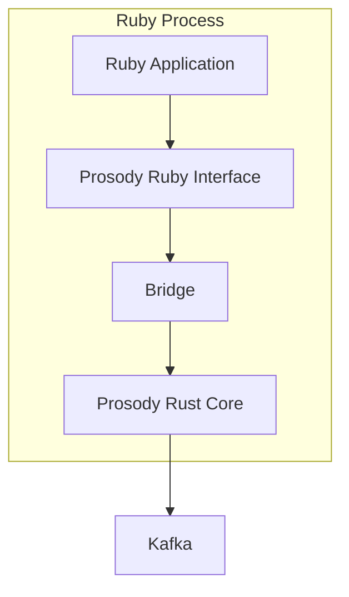
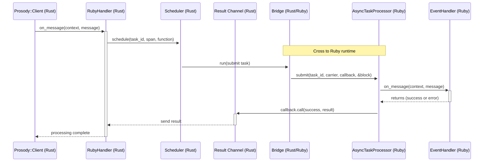
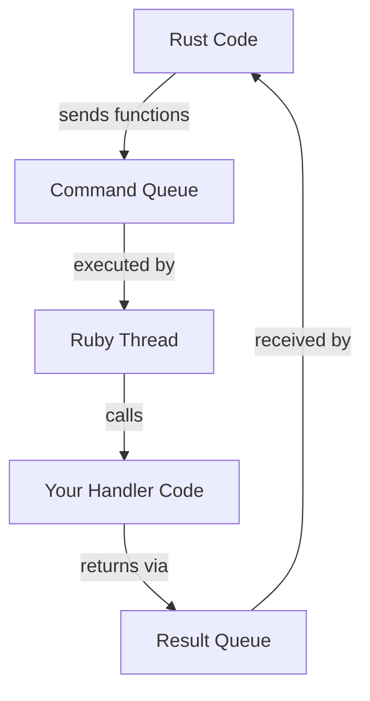
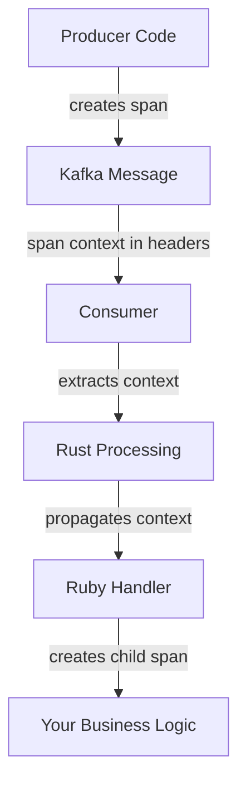

# Prosody Ruby Architecture: Under The Hood

This document explains how the Prosody Ruby gem works internally. We'll start with high-level concepts, then dive deeper
into the components and their interactions.

## The Basics: What Makes Prosody Different

Ruby gems for Kafka typically fall into three categories:

- Pure Ruby implementations (simple but performance-limited by the GVL)
- C library bindings (better performance but expose low-level Kafka internals)
- Java wrappers (performant but require JRuby and non-idiomatic APIs)

Existing Ruby Kafka gems process messages synchronously—one per partition at a time—so a slow message blocks all others
behind it, regardless of key. Prosody is async, processing multiple messages per partition concurrently while preserving
per-key order. This approach creates unique challenges:

1. **Bridging two languages**: Ruby and Rust have different memory models and concurrency approaches
2. **Concurrent processing**: Processing messages efficiently without blocking
3. **Safe communication**: Ensuring that errors in one language don't crash the other

## Background Concepts

Before diving into Prosody's architecture, let's understand some key concepts:

### The Global VM Lock (GVL)

Ruby's interpreter uses a Global VM Lock (GVL) that allows only one thread to execute Ruby code at a time. This means:

- Multiple Ruby threads can exist, but only one runs Ruby code at any moment
- When a thread performs I/O or other blocking operations, it can release the GVL
- Native extensions (like our Rust code) can release the GVL to let other Ruby threads run

### The Ruby/Rust Thread Boundary

A critical limitation: **Rust cannot directly call Ruby methods from Rust-created threads**. This is because:

1. Only Ruby-created threads can safely run Ruby code
2. Ruby's memory management expects certain thread-local state
3. Running Ruby code from a non-Ruby thread can cause memory corruption or crashes

This is why we need a bridge—a dedicated Ruby thread that can safely execute Ruby code on behalf of Rust.

### Fibers and Cooperative Concurrency

Ruby supports lightweight threads called Fibers that enable cooperative concurrency:

- Fibers are managed by Ruby (not the OS)
- A Fiber runs until it explicitly yields control
- Multiple Fibers can run on a single Ruby thread
- The `async` gem builds a concurrency framework on top of Fibers

### Blocking vs. Yielding: A Critical Distinction

In concurrent programming:

- **Blocking**: Stops an entire thread, preventing any code in that thread from running
- **Yielding**: Pauses the current Fiber but allows other Fibers in the same thread to run

This distinction is crucial for Prosody's performance. Consider two approaches:

```ruby
# Approach 1: Blocking
def process_messages
  # This blocks the entire thread while waiting
  result = blocking_operation()
  # No other work happens during the wait
end

# Approach 2: Yielding
def process_messages
  Async do
    # This yields the fiber while waiting, letting other fibers run
    result = queue.pop
    # Other fibers continue working during the wait
  end
end
```

When processing thousands of messages, yielding allows much higher throughput because work continues during waits.

## Architecture Overview

Prosody combines a Rust core with a Ruby interface:



### Main Components

1. **Ruby Interface Layer**: The classes you interact with directly
    - `Prosody::Client`: The main entry point for applications
    - `Prosody::EventHandler`: Base class for handling messages
    - `Prosody::Message`: Represents a Kafka message

2. **Rust Core**: The foundation
    - Kafka Connectivity: Handles the connection to Kafka brokers
    - Message Processing: Decodes, routes, and processes messages
    - Error Handling: Manages retries and error classification

3. **Bridge**: The crucial connection between Ruby and Rust
    - Enables safe communication between languages
    - Manages memory safety across the boundary
    - Handles concurrency coordination

## Message Flow

This sequence diagram shows how a message flows through the system:



Let's break this down:

1. **Message Reception**: Rust client receives a message from Kafka
2. **Scheduling**: The message is prepared for processing in Ruby
3. **Bridge Crossing**: A function is scheduled to run in Ruby-land
4. **Task Processing**: Your handler code processes the message
5. **Result Reporting**: The result is sent back to Rust
6. **Completion**: Processing finishes and Kafka offsets can be committed

## The Bridge: How Ruby and Rust Communicate

The Bridge is the most complex part of Prosody. It allows two different languages with different concurrency models to
work together safely.

### Why We Need A Bridge

Rust cannot directly call Ruby methods from Rust threads. Consider what would happen without a bridge:

```
Rust Thread → directly calls → Ruby method
                   ↓
    🔥 Memory corruption or crash 🔥
```

Instead, we need a bridge pattern:

```
Rust Thread → sends command → Ruby Thread → safely executes → Ruby method
                    ↓                              ↓
         Waits for completion           Returns result back to Rust
```

The bridge provides this safe communication channel between languages.

### How it Works: Queue-Based Communication

The Bridge uses queues (or channels) to pass data between Ruby and Rust:



1. **Command Queue**: Rust puts functions to be executed in a queue
2. **Ruby Thread**: A dedicated Ruby thread executes these functions
3. **Result Queue**: Results flow back through another queue

The bridge operates as a continuous poll loop, constantly checking for new functions to execute:

```
Loop:
  1. Check for commands in the queue
  2. If found, acquire GVL and execute in Ruby
  3. Send results back
  4. Release GVL and continue polling
```

This polling approach allows the bridge to efficiently process commands while minimizing GVL contention.

### Why Queues Instead of Just Releasing the GVL?

You might wonder: "Why not just release the GVL and let Rust do its work directly?"

The answer is multi-layered:

1. **Thread Ownership**: Only Ruby-created threads can safely run Ruby code
2. **Concurrency Model**: Releasing the GVL lets other Ruby threads run, but doesn't help with fiber-based concurrency
3. **Cooperative Yielding**: Using Ruby's `Queue` operations causes the current fiber to yield, enabling other fibers to
   run

This is critical for Prosody's high-concurrency processing model. By using queues with fiber-aware operations, we get
the best of both worlds:

```ruby
# This is what happens inside Prosody's processing loop
Async do
  # When queue.pop is called, this fiber yields control
  result = queue.pop

  # During the yield, other fibers can run and process other messages
  # When the result is available, this fiber resumes
  process_result(result)
end
```

### Concrete Example: Processing a Message

When a message arrives from Kafka:

1. Rust code receives the message from Kafka
2. It creates a Ruby-compatible wrapper for the message
3. It places a function in the command queue: "call handler.on_message with this message"
4. The Ruby thread picks up this function and executes it
5. Your handler processes the message and returns a result
6. The result is placed in a result queue
7. Rust code receives the result and updates Kafka offsets

### Code Flow Example

Here's a simplified view of how the bridge works:

```ruby
# CONCEPTUAL MODEL: How Prosody communicates between Ruby and Rust
# (this is simplified to show the concept, not actual implementation)

# 1. Ruby side: How your code interfaces with the bridge
client = Prosody::Client.new(config)
client.subscribe(MyHandler.new)

# 2. Behind the scenes: What happens when a message arrives from Kafka
#
#    In Rust: Message from Kafka → Added to processing queue
#                                ↓
#    Bridge poll loop: Takes message from queue → Schedules Ruby execution
#                                               ↓
#    In Ruby: Your handler processes message → Returns result
#                                            ↓
#    Bridge poll loop: Takes result → Reports back to Rust
#
# The bridge continuously polls for commands to execute and results to collect

# 3. How the bridge executes your handler (simplified Ruby-like pseudocode)
def bridge_poll_loop
  loop do
    # Get next command from the queue (yields while waiting)
    command = command_queue.pop

    # Execute the command in the Ruby context
    if command.is_a?(ExecuteHandler)
      begin
        # Call your handler with the message
        result = command.handler.on_message(command.context, command.message)
        # Report success back through the result channel
        command.result_channel.send(success: true, result: result)
      rescue => e
        # Report failure back through the result channel
        command.result_channel.send(success: false, error: e)
      end
    end
  end
end
```

## AsyncTaskProcessor: Ruby-Side Concurrent Processing

The `AsyncTaskProcessor` is the Ruby component that manages concurrent task execution:

```ruby
# Conceptual implementation (simplified)
class AsyncTaskProcessor
  def initialize
    @command_queue = Queue.new  # Thread-safe queue for commands
  end

  def start
    @thread = Thread.new do
      Async do  # Start the async reactor
        loop do
          # This yields the fiber while waiting for a command
          command = @command_queue.pop

          case command
          when Execute
            # Execute the task in a new fiber
            Async do
              begin
                command.block.call  # Run the actual task
                command.callback.call(true, nil)  # Signal success
              rescue => e
                command.callback.call(false, e)  # Signal failure
              end
            end
          when Shutdown
            break  # Exit the loop and terminate
          end
        end
      end
    end
  end

  def submit(task_id, callback, &block)
    token = CancellationToken.new
    @command_queue.push(Execute.new(task_id, callback, token, block))
    token
  end

  def stop
    @command_queue.push(Shutdown.new)
    @thread.join
  end
end
```

This class is critical because:

1. It creates a fiber-based concurrency environment using `Async`
2. It processes tasks concurrently without blocking
3. It enables work to continue even when some tasks are waiting
4. It provides a clean mechanism for task cancellation

## The Power of Cooperative Concurrency

Prosody uses Ruby's `async` gem to process multiple messages concurrently without blocking:

```ruby
# How Prosody processes multiple messages concurrently
#
# Without concurrency (traditional approach):
#   [Message 1] → Process → Done
#                   ↓
#   [Message 2] → Process → Done
#                   ↓
#   [Message 3] → Process → Done
#
# With Prosody's fiber-based concurrency:
#   [Message 1] → Start → Yield while waiting → Resume → Done
#        ↓
#   [Message 2] → Start → Yield while waiting → Resume → Done
#        ↓
#   [Message 3] → Start → Yield while waiting → Resume → Done
#
# This allows processing to continue even when some messages are waiting
# for external resources (database, API calls, etc.)

# Simplified version of how Prosody processes a single message:
def process_message(message)
  Async do
    # Create two concurrent fibers

    # Worker fiber that processes the message
    Async do
      begin
        # Call your handler
        handler.on_message(context, message)
        report_success()
      rescue => e
        report_error(e)
      end
    end

    # Cancellation watcher fiber
    Async do
      # This yields while waiting for cancellation
      cancellation_token.wait
      # Handle cancellation if needed
    end
  end
end
```

Let's break down what happens when a message is processed:

1. Two fibers are created to handle the message
2. The worker fiber calls your handler code
3. The cancellation watcher monitors for cancellation signals
4. If one fiber is waiting (e.g., for I/O), the other can continue running
5. This allows concurrent processing even with Ruby's GVL

## The CancellationToken System

Prosody needs to gracefully cancel in-progress tasks (e.g., during shutdown). It uses a token system:

```ruby
# How Prosody handles graceful cancellation
#
# When you call client.unsubscribe or the process is shutting down:
#
# 1. Prosody signals cancellation to in-progress messages
# 2. Your handler can detect cancellation and clean up
# 3. Resources are released properly
#
# Implementation (simplified):
class CancellationToken
  def initialize
    @queue = Queue.new  # Thread-safe queue for signaling
  end

  def cancel
    # Signal cancellation request
    @queue.push(:cancel)
  end

  def wait
    # Wait for cancellation signal (yields the fiber while waiting)
    @queue.pop
    true
  end
end

# Prosody uses this system to ensure resources are properly cleaned up:
# - Database transactions are rolled back
# - Temporary files are closed
# - Network connections are terminated
```

Why use a Queue instead of a simple flag? Because `Queue#pop` is fiber-aware:

1. When `wait` is called, the fiber yields
2. Other fibers can continue running
3. When `cancel` is called, the waiting fiber resumes

This enables non-blocking cancellation coordination between fibers.

## Error Handling and Classification

Prosody has a sophisticated error handling system that classifies errors as permanent or transient:

### Error Classification

```ruby
class MyHandler < Prosody::EventHandler
  # Tell Prosody: "Don't retry these errors - they won't succeed"
  permanent :on_message,
    ArgumentError,    # Bad arguments - won't fix themselves
    TypeError,        # Type mismatches - message format issues
    JSON::ParseError  # Corrupt data - retrying won't help

  # Tell Prosody: "Do retry these errors - they might succeed later"
  transient :on_message,
    NetworkError,            # Network might recover
    ServiceUnavailableError, # Service might become available
    TimeoutError             # Operation might complete next time

  def on_message(context, message)
    # Process message...
    user_id = message.payload.fetch("user_id")
    api_result = ApiClient.call(user_id)
    Database.save(api_result)
  end
end
```

Under the hood, this works by:

1. Using Ruby's method wrapping capabilities to intercept exceptions
2. Re-raising caught exceptions as either `PermanentError` or `TransientError`
3. These error types implement a `permanent?` method that Rust code can check
4. Rust applies the appropriate retry strategy based on this classification

The implementation uses Ruby's metaprogramming to wrap methods:

```ruby
# Simplified version of the error classification mechanism
module ErrorClassification
  def permanent(method_name, *exception_classes)
    wrap_errors(method_name, exception_classes, PermanentError)
  end

  def transient(method_name, *exception_classes)
    wrap_errors(method_name, exception_classes, TransientError)
  end

  private

  def wrap_errors(method_name, exception_classes, error_class)
    # Create a module that will be prepended to the class
    wrapper = Module.new do
      define_method(method_name) do |*args, &block|
        begin
          # Call the original method
          super(*args, &block)
        rescue *exception_classes => e
          # Re-raise as the appropriate error type
          raise error_class.new(e.message)
        end
      end
    end

    # Prepend the wrapper module to intercept method calls
    prepend wrapper
  end
end
```

## OpenTelemetry Integration

Prosody automatically traces message processing across the Ruby-Rust boundary:



The trace context flows:

1. From producing code into Kafka message headers
2. From Kafka to the Rust consumer
3. Through the bridge to your Ruby handler
4. Into any nested operations you perform

This gives you end-to-end visibility of message processing across systems.

## Key Technical Points

### Memory Safety Across Languages

Rust's ownership system prevents memory leaks and data races, but special care is needed at the Ruby boundary:

- Ruby objects referenced by Rust are protected from garbage collection
- Rust manages memory that crosses the boundary
- Cleanup happens automatically when objects are no longer needed

The bridge uses several techniques to ensure safety:

1. **BoxValue**: Safely wraps Ruby values and prevents them from being garbage collected
2. **AtomicTake**: Ensures values can only be consumed once
3. **Queues**: Provide coordination between Rust and Ruby

### Concurrency Coordination

Prosody coordinates three concurrency mechanisms:

1. **Ruby Threads**: Limited by the GVL, good for I/O-bound operations
2. **Ruby Fibers**: Lightweight, cooperative concurrency within a thread
3. **Rust Tasks**: Asynchronous, non-blocking operations in Rust

The key insight is that by using queues with fiber-aware operations, we get the best of all worlds.

### GVL Management

The Bridge carefully manages Ruby's GVL:

- Releases the GVL when executing Rust code
- Acquires the GVL when calling into Ruby
- Batches operations to minimize GVL acquisition overhead

```ruby
# CONCEPTUAL MODEL: How Ruby's Global VM Lock works with Prosody
#
# Ruby normally allows only one thread to run Ruby code at a time:
#
#     Thread 1 ---> Ruby VM ---> Thread 2 ---> Thread 3
#      running       (GVL)        waiting       waiting
#
# Prosody can temporarily release the GVL when running Rust code:
#
#     Thread 1 ---> Ruby VM <--- Thread 2       Thread 3
#    running Rust     (GVL)       running       waiting
#       code                     Ruby code
#
# The bridge poll loop constantly alternates between:
# 1. Releasing the GVL to handle Rust operations efficiently
# 2. Acquiring the GVL to execute Ruby code when needed
#
# This keeps your Ruby application responsive while Prosody
# handles heavy processing in Rust
```

### Yielding For Maximum Concurrency

Prosody uses queues extensively to coordinate between components:

- **Command Queue**: Rust → Ruby function execution
- **Result Queue**: Ruby → Rust result reporting
- **Cancellation Queue**: Signaling task cancellation

The key advantage of using queues is that operations like `Queue#pop` yield the current fiber instead of blocking the
entire thread. This allows other fibers to run concurrently, maximizing throughput.

## The Full Picture

Putting it all together, Prosody's architecture enables:

1. **Efficient Processing**: Messages are processed concurrently without blocking
2. **Safe Language Interop**: Ruby and Rust communicate without memory issues
3. **Graceful Error Handling**: Errors are properly classified and handled
4. **Distributed Tracing**: Operations are traced across system boundaries
5. **Resource Management**: Memory and connections are properly cleaned up

This hybrid approach gives you the performance benefits of Rust with the developer experience of Ruby, all while
maintaining safety and reliability.

## Practical Implications

Understanding this architecture helps you write better Prosody applications:

1. **Write Non-Blocking Handlers**: Use async I/O in your handlers to maximize concurrency
   ```ruby
   def on_message(context, message)
     # Good: Uses async HTTP client that yields while waiting
     response = AsyncHTTP.get(message.payload["url"])

     # When response arrives, processing resumes
     save_result(response)
   end
   ```

2. **Classify Errors Properly**: Use `permanent` and `transient` to control retry behavior
   ```ruby
   # Retry network errors, but not data errors
   transient :on_message,
     NetworkError,            # Network might recover
     ServiceUnavailableError, # Service might become available
     DatabaseConnectionError  # Database might come back online

   permanent :on_message,
     ValidationError,         # Bad data - won't fix itself
     DataFormatError,         # Schema mismatch - retrying won't help
     AuthorizationError       # Permission issues need manual fixing
   ```

3. **Ensure Clean Shutdown**: Always call `unsubscribe` before exiting
   ```ruby
   # Set up a shutdown queue
   shutdown = Queue.new
   
   # Configure signal handlers to trigger shutdown
   Signal.trap("INT") { shutdown.push(nil) }
   Signal.trap("TERM") { shutdown.push(nil) }
   
   # Subscribe to messages
   client.subscribe(MyHandler.new)
   
   # Block until a signal is received
   shutdown.pop # This blocks until something is pushed to the queue by a signal handler
   
   # Clean shutdown
   puts "Shutting down gracefully..."
   client.unsubscribe

   # This ensures:
   # - In-progress messages complete or cancel gracefully
   # - Resources are properly released
   # - Kafka offsets are committed correctly
   ```

4. **Monitor with Traces**: Use OpenTelemetry to understand message processing
   ```ruby
   def on_message(context, message)
     # Create a child span (parent span is automatic)
     OpenTelemetry.tracer.in_span("process_payment") do |span|
       payment = message.payload

       # Add context to help with debugging and monitoring
       span.add_attributes({
         "payment.id" => payment["id"],
         "payment.amount" => payment["amount"]
       })

       # Process the message
       process_payment(payment)
     end
   end
   ```

By leveraging Prosody's architecture, you can build high-performance, reliable Kafka applications in Ruby.
