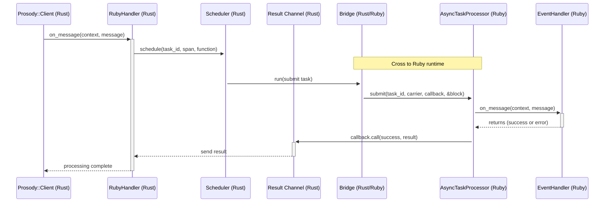

# Prosody Architecture Overview

This document provides an architectural overview of the Prosody system, focusing on the interaction between its Rust and
Ruby components. The system is designed to process Kafka messages efficiently, leveraging Rust for high-performance
operations and Ruby for user-defined message handling logic.

## Sequence Diagram

Below is the sequence diagram illustrating the flow of processing a Kafka message in the Prosody system:

## Components

### 1. **Prosody::Client (Rust)**

The `Client` is the main entry point for interacting with the Prosody system. It is responsible for:

- Receiving messages from Kafka.
- Delegating message processing to the `RubyHandler`.

### 2. **RubyHandler (Rust)**

The `RubyHandler` acts as a bridge between Kafka messages and Ruby-defined message handlers. It:

- Converts Kafka messages into Ruby-compatible objects.
- Schedules the execution of Ruby handlers using the `Scheduler`.
- Waits for the result of the Ruby handler execution via the `ResultChannel`.

### 3. **Scheduler (Rust)**

The `Scheduler` is responsible for:

- Managing the lifecycle of tasks that need to be executed in the Ruby runtime.
- Propagating OpenTelemetry tracing context to Ruby.
- Submitting tasks to the `AsyncTaskProcessor` in Ruby via the `Bridge`.

### 4. **Result Channel (Rust)**

The `ResultChannel` is a one-shot communication channel used to:

- Send the result of a Ruby handler's execution back to the `RubyHandler`.
- Ensure that results are only sent once and are properly handled.

### 5. **Bridge (Rust/Ruby)**

The `Bridge` facilitates communication between Rust and Ruby. It ensures safe and efficient interaction between the two
runtimes by:

- **Ruby Thread Safety**: Ensuring all calls to Ruby are made from a Ruby thread, as required by the Ruby runtime.
- **Poll Loop**: Running a poll loop in a dedicated Ruby thread to process Rust-to-Ruby calls. This loop takes
  messages (closures) from a Rust queue and executes them in the Ruby runtime.
- **GVL Management**: Releasing the Global VM Lock (GVL) during polling to allow other Ruby threads to run concurrently.
- **Async Ruby Calls**: Representing Ruby calls as Rust futures, enabling non-blocking interactions between the two
  runtimes.
- **Ruby Waiting on Rust Futures**: Allowing Ruby code to wait on Rust futures without blocking the Ruby runtime. This
  is achieved using Ruby's `Thread::Queue`, which yields control when run on a Fiber-based runtime (e.g., `async` gem).

### 6. **AsyncTaskProcessor (Ruby)**

The `AsyncTaskProcessor` is a Ruby class that:

- Executes tasks asynchronously using the `async` gem.
- Propagates OpenTelemetry tracing context for distributed tracing.
- Handles task cancellation and ensures graceful shutdown.

### 7. **EventHandler (Ruby)**

The `EventHandler` is a user-defined Ruby class that processes messages. It:

- Implements the `on_message(context, message)` method to define custom message handling logic.
- Can classify errors as permanent or transient for retry logic.

## Flow Description

### 1. **Message Received from Kafka**

- The `Client` receives a message from Kafka and invokes the `on_message` method on the `RubyHandler`.

### 2. **Prepare for Processing in Ruby**

- The `RubyHandler` schedules the execution of the Ruby handler using the `Scheduler`.
- It provides a unique task ID, tracing span, and a closure (`function`) to be executed in Ruby.

### 3. **Bridge to Ruby Runtime**

- The `Scheduler` uses the `Bridge` to submit the task to Ruby.
- The `Bridge` invokes the `submit` method on the `AsyncTaskProcessor` in Ruby, passing the task ID, OpenTelemetry
  context carrier, a callback, and the task block.

### 4. **Process in Ruby**

- The `AsyncTaskProcessor` executes the task block, which calls the `on_message` method on the user-defined
  `EventHandler`.
- The `EventHandler` processes the message and returns either a success or an error.

### 5. **Callback to ResultChannel**

- The `AsyncTaskProcessor` invokes the callback with the result of the task (success or error).
- The callback sends the result to the `ResultChannel`.

### 6. **Result Received by RubyHandler**

- The `RubyHandler` waits for the result from the `ResultChannel`.
- Once the result is received, it completes the processing of the message.

### 7. **Complete Processing**

- The `RubyHandler` notifies the `Client` that the message processing is complete.

## Key Features

### 1. **Asynchronous Processing**

- Tasks are executed asynchronously in Ruby using the `async` gem, allowing for high concurrency and efficient resource
  utilization.

### 2. **OpenTelemetry Integration**

- Tracing context is propagated across Rust and Ruby boundaries, enabling distributed tracing for end-to-end
  observability.

### 3. **Error Classification**

- Errors raised by the `EventHandler` can be classified as permanent or transient, allowing for fine-grained control
  over retry logic.

### 4. **Cancellation Support**

- Tasks can be canceled mid-execution using a `CancellationToken`, ensuring that resources are not wasted on unnecessary
  work.

### 5. **Graceful Shutdown**

- The `AsyncTaskProcessor` ensures that all in-flight tasks are completed before shutting down, maintaining data
  integrity.
